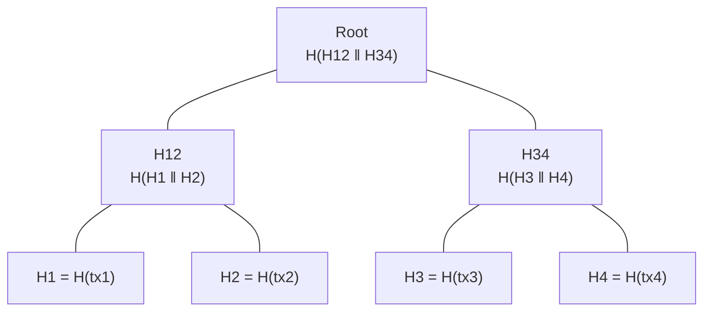

# The Cryptographic Primitives You Actually Need

You can understand every blockchain in production today with a surprisingly small cryptographic toolkit. Three primitives do almost all of the work: **hash functions**, **digital signatures**, and **Merkle trees** (which are themselves just hash functions used cleverly). Everything exotic — zero-knowledge proofs, threshold signatures, verifiable random functions — is a refinement that sits on top, and we'll get to the refinements when we need them.

This chapter is a working engineer's reference for the three basics. If you already know this material, skim the worked examples and move on to Chapter 4. If you don't, this chapter is the one to take slowly.

## Hash functions

A cryptographic hash function `H` takes arbitrary-length input and produces a fixed-length output, typically 256 bits (32 bytes). For blockchains, the workhorse is SHA-256 (used by Bitcoin) or Keccak-256 (used by Ethereum); they differ in internal structure, but for our purposes they have the same shape: bytes in, 256 bits out, deterministic, fast.

A *cryptographic* hash function — as opposed to a non-cryptographic one like the hash underlying Python's dict — has three properties that matter:

**1. Preimage resistance.** Given a hash output `h`, it's computationally infeasible to find *any* input `x` such that `H(x) = h`. You cannot invert the function. If you see a hash, you cannot recover what was hashed, even in principle, short of brute force.

**2. Second-preimage resistance.** Given a specific input `x`, it's infeasible to find a *different* input `y ≠ x` such that `H(y) = H(x)`. Even if you know one preimage, you can't construct a colliding alternative.

**3. Collision resistance.** It's infeasible to find *any* pair of inputs `x ≠ y` with `H(x) = H(y)`. This is stronger than second-preimage resistance, because you're free to choose both inputs. For a good 256-bit hash, brute-forcing a collision takes on the order of `2^128` operations, by the birthday bound — a number so large that, in practice, collisions don't happen.

For the math-curious: the birthday bound says that in a random function with `N` possible outputs, you expect a collision after about `√N` samples. For `N = 2^256`, that's `2^128` — roughly `3.4 × 10^38` samples. Current hardware performs about `2^80` hash operations per year globally. You would need `2^48` years, or roughly `2.8 × 10^14` years, to hit a collision at that rate. The universe is about `1.4 × 10^10` years old. We are very safe.

### What we use hashes for

Three things, over and over:

- **Commitment.** If I publish `H(x)` now, I have committed to `x` without revealing it. Later, I can reveal `x`; you can verify it matches the earlier hash. I can't change my mind, because I can't find a different `x' ≠ x` with `H(x') = H(x)` (second-preimage resistance).

- **Identity.** A hash of a public key serves as a compact, unforgeable identifier — your "address" on most blockchains is, essentially, `H(public_key)`. The address is short (20–32 bytes) and reveals nothing about the key.

- **Puzzles.** If I ask you to find an `x` such that `H(prefix || x) < target`, the only way is to try values of `x` until you get lucky. This is Proof of Work in a sentence, which Chapter 5 will expand on.

One quick gut-check exercise, so you see it yourself:

```python
import hashlib
def sha256(s: str) -> str:
    return hashlib.sha256(s.encode()).hexdigest()

print(sha256("blockchain"))
# ef7797e13d3a75526946a3bcf00daec9fc9c9c4d51ddc7cc5df888f74dd434d1

print(sha256("blockchains"))
# 8a6b6c... (completely different)
```

A one-character change produces an entirely unrelated output. This is the *avalanche* property, and it's what makes hashes useful as commitments. You cannot nudge a hash in a desired direction by nudging the input.

## Digital signatures

Digital signatures are the second primitive. In a signature scheme — Bitcoin and Ethereum both use ECDSA on the secp256k1 curve, though Ethereum is migrating parts of its ecosystem to BLS — you have:

- A **private key** `sk`, which you generate randomly and keep secret.
- A **public key** `pk`, derived from `sk` by a one-way function. Anyone can see `pk`; no one can derive `sk` from it.
- A **signing function** `sign(sk, message) → signature`.
- A **verification function** `verify(pk, message, signature) → true/false`.

The security property: without `sk`, producing a signature that verifies under `pk` is infeasible. With `sk`, it's a constant-time operation.

### What a signature proves — and doesn't

This is the part where newcomers consistently overclaim. A valid signature on a message proves exactly one thing:

> Someone with access to the private key corresponding to `pk` authorized exactly this message.

That is it. In particular, a signature does **not** prove:

- **Who the signer is**, in any real-world sense. It proves control of a key, not the identity of a human.
- **When the signature was produced.** There's no timestamp in a bare signature. If you want time, you need something external (like a blockchain — which is in fact one way to get it).
- **That the message hasn't been seen before.** The same valid message-signature pair can be replayed indefinitely unless the message itself contains something that prevents replay — a nonce, a block height, a transaction counter. Forgetting this has caused many real-world bugs.
- **That the signer meant this message in context.** A signature over the bytes `"Pay Bob 1 BTC"` says nothing about which Bob, which chain, or which time. If your protocol doesn't include those in the signed payload, the signature will happily travel to a different context and apply there.

Double-spending, from Chapter 1, is a direct consequence: Alice's signatures on `Transfer(coin_42, →Bob)` and `Transfer(coin_42, →Carol)` are both cryptographically valid. Signatures by themselves don't prevent conflict. Ordering does.

## Merkle trees

The third primitive is the one that makes blockchains scalable in practice. A Merkle tree is a binary tree where every non-leaf node is the hash of its two children. You build it bottom-up from a list of items — often transactions in a block.



The leaves are hashes of individual items. The internal nodes are hashes of concatenated pairs. The **root** — a single 32-byte value — commits to the entire set. If any item changes, the root changes; if the root matches, the entire tree matches.

### What Merkle trees buy you

**Compact commitment.** To commit to a million transactions, you publish one 32-byte root. The verifier doesn't need to see the transactions to know they're locked in.

**Efficient membership proofs.** To prove that `tx3` is in the tree, you don't need to show the verifier every transaction. You show them `tx3` plus the **Merkle path** — the siblings along the route from `tx3` to the root:

```
tx3 → hash → H3
H3 ‖ H4   → hash → H34   (you provide H4)
H12 ‖ H34 → hash → Root  (you provide H12)
```

The verifier recomputes up the tree and checks that they land on the known root. A tree of `n` leaves has Merkle paths of length `log₂(n)`. For a million transactions, that's 20 hashes — 640 bytes. For a billion transactions, 30 hashes — 960 bytes. The log growth is what makes Merkle proofs practical at any real-world scale.

This matters enormously for light clients. A light Bitcoin client doesn't store every transaction; it stores block headers, which include Merkle roots. When someone tells it "your payment is in block `N`," the client receives a Merkle path, verifies against the root in block `N`'s header, and has cryptographic proof the transaction was included — without downloading the rest of the block.

### Worked example

Let's actually compute one. Four transactions, SHA-256.

```python
import hashlib

def h(b: bytes) -> bytes:
    return hashlib.sha256(b).digest()

txs = [b"Alice->Bob: 1",
       b"Alice->Carol: 2",
       b"Bob->Dave: 3",
       b"Carol->Eve: 4"]

# Leaves
L = [h(tx) for tx in txs]
# Next level
N = [h(L[0] + L[1]), h(L[2] + L[3])]
# Root
root = h(N[0] + N[1])

print(root.hex())
# 4d2f... (a single 32-byte digest commits to all four transactions)
```

Now a membership proof for `txs[2] = b"Bob->Dave: 3"`. The path is `[L[3], N[0]]`:

```python
proof = [L[3], N[0]]
target = b"Bob->Dave: 3"

# Reconstruct the root using the proof.
node = h(target)          # L[2]
node = h(node + proof[0]) # N[1] = h(L[2] + L[3])
node = h(proof[1] + node) # root = h(N[0] + N[1])

assert node == root
```

That's it. Three hashes, 96 bytes of path (two 32-byte siblings plus the item), and you've proven membership in a tree without revealing the other leaves.

A note on positional ordering: the proof has to tell you *which side* each sibling goes on — above, `L[3]` goes on the right of `L[2]`, but `N[0]` goes on the left of `N[1]`. Real implementations tag each proof step with a left/right bit (or reconstruct position from an index). Get this wrong and your proofs silently fail to verify.

## Hash pointers and the chain

We now have enough to build the "chain" in blockchain.

A **hash pointer** is just what it sounds like: a reference to some data, plus the hash of that data. If the data changes, the hash no longer matches, and the reference is obviously stale. You can chain these:

```
Block 3 contains hash(Block 2)
Block 2 contains hash(Block 1)
Block 1 contains hash(Genesis block)
```

This is a linked list with integrity checking. If anyone tries to alter Block 1 after the fact, its hash changes, which means Block 2's reference to it no longer matches, which means Block 3's reference to Block 2 no longer matches (because Block 2 contains Block 1's old hash, not the new one — but anyone recomputing Block 2 to fix that hash changes *Block 2's* hash, which breaks Block 3's reference, and so on). The past is tamper-evident: changing one historical block requires recomputing every block after it.

Inside each block, the transactions are typically arranged as a Merkle tree, with the root stored in the block header. So a block header is small — on the order of 80 to a few hundred bytes — and yet it commits to every transaction in the block and every prior block in the chain.

This is the full shape of a blockchain's data structure. *Chains of blocks, each containing a Merkle root of transactions and a hash pointer to its predecessor.* There's nothing more to it than that.

What it doesn't tell you is how to decide which blocks go in the chain in the first place, or what happens when two valid blocks appear at the same height. That's consensus, and consensus is where the interesting engineering lives. We've now spent three chapters sharpening the question. It's time to build something.
